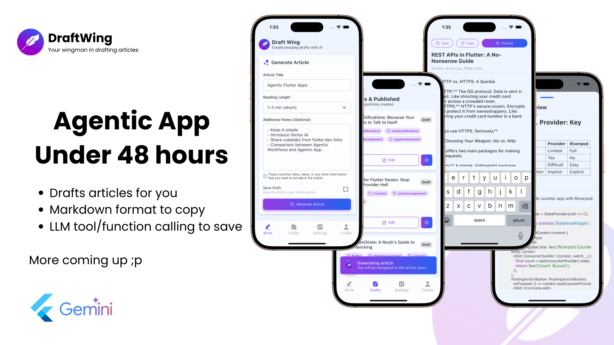
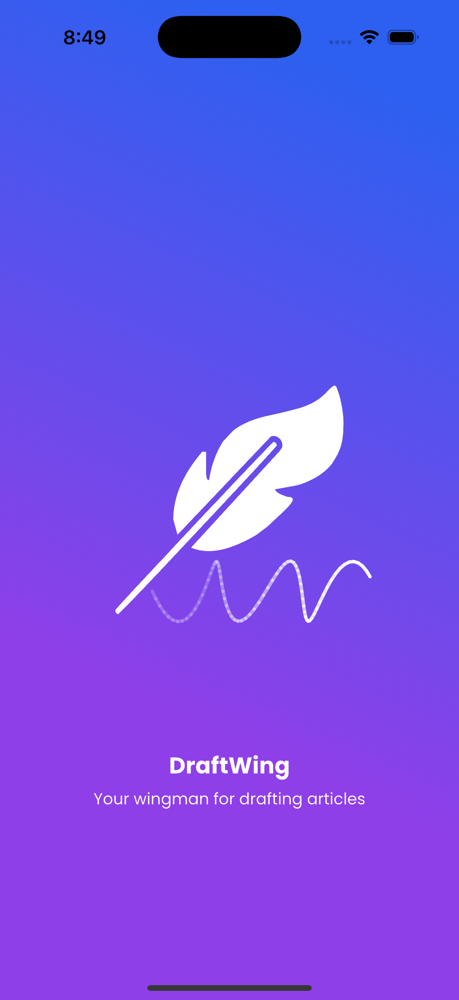
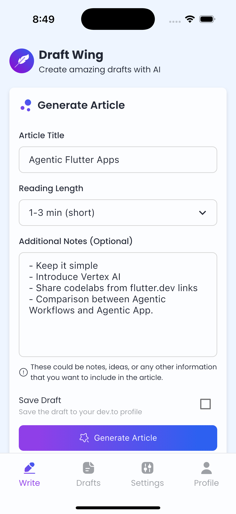
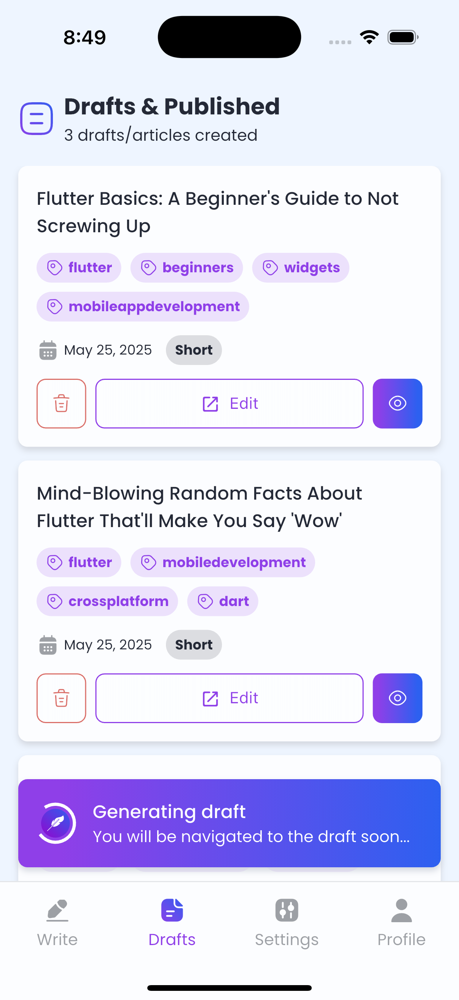
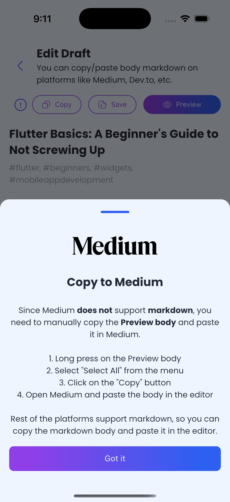
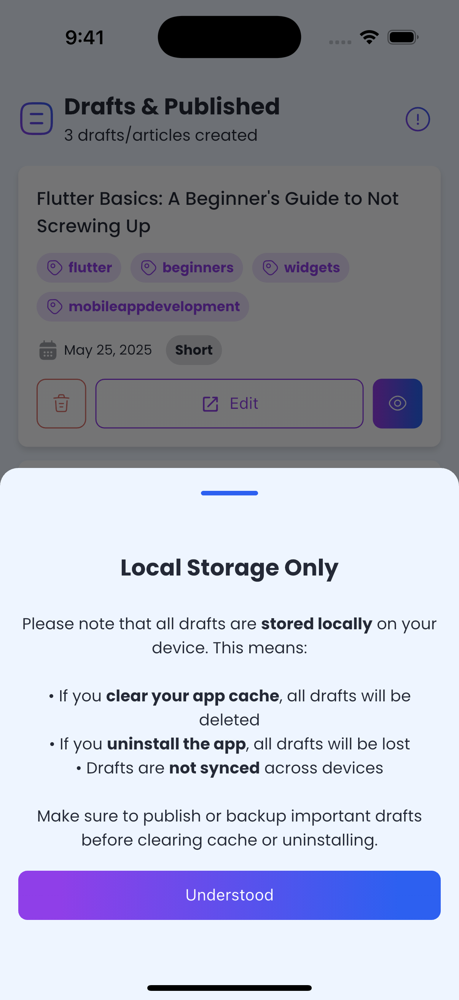
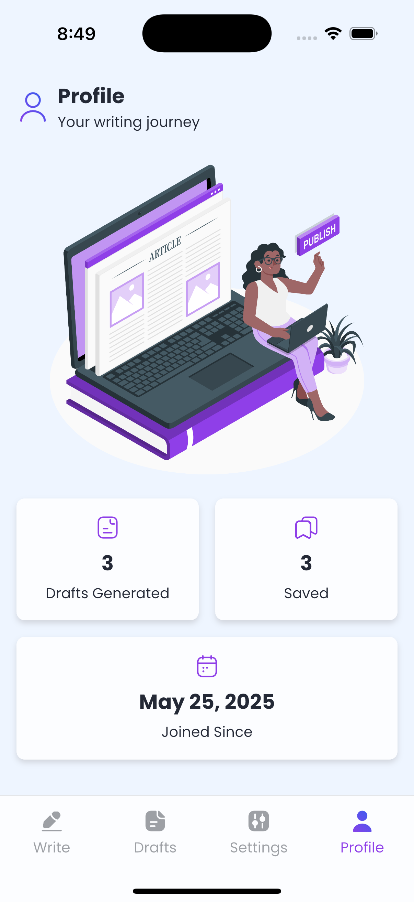

# 🦋 DraftWing
Agentic mobile app developed using [Flutter](https://flutter.dev) powered by [Vertex AI](https://cloud.google.com/vertex-ai). Simply developed to generate drafts for articles that you can validate and publish on platforms like [Medium](https://medium.com/) or [Dev.to](https://dev.to/).

"DraftWing" name is extracted as:
- "Draft" -> Generates Draft for you
- "Wing" -> Flutter

Hence, your wingman in drafting articles ;p



## 📲 Features
DraftWing lets you:
- ✍🏼 Generate drafts based on few parameters
- 👀 Preview the draft markdown in real-time
- © Copy the markdown body, or preview body
- 💾 Lets you save the draft in your local storage
- 🤖 Does all the work without interrupting users
- 🌚 Last, but not the least dynamic theme ;p (i know, i know)

## 📝 System Prompt
You can explore the system prompt in details in [prompt.md](assets/prompt.md) file. For now its targetting Flutter's topci feel free to change this as per your requirements.

```
// --- this part in file --- //

## Your Capabilities

You are knowledgeable in:

- Flutter and Dart
- Firebase and its ecosystem
- State management (e.g., BLoC, Riverpod, provider etc.)
- Clean architecture patterns
```

More details can be found at: https://codelabs.developers.google.com/codelabs/flutter-gemini-colorist#3

## 🧑🏼‍💻 Development Setup
Clone the repo, you know how to do it otherwise open CMD/Terminal and simply: 
```
git clone https://github.com/mhmzdev/draftwing
cd draftwing
flutter pub get
flutter run
```
### SDKs Versions
Below is `flutter doctor` output:
```zsh
Doctor summary (to see all details, run flutter doctor -v):
[✓] Flutter (Channel stable, 3.29.2, on macOS 15.5 24F74 darwin-arm64, locale en-PK)
[✓] Android toolchain - develop for Android devices (Android SDK version 34.0.0)
[✓] Xcode - develop for iOS and macOS (Xcode 16.2)
[✓] Chrome - develop for the web
[✓] Android Studio (version 2024.1)
[✓] VS Code (version 1.99.3)
[✓] Connected device (5 available)
[✓] Network resources

• No issues found!
```
### Firebase Requirements (Careful)
Since, it involves the usage of Vertex AI so you need to setup firebase for this app. BUT WAIT! All you've to do is place:
- `google-services.json` for Android
- `GoogleService-Info.plist` for iOS

The reset of the changes are already done because I did integrate Firebase for this app 😇

| NOTE: Avoid uploading your .json files if you're open source it because you'll be charged for the usage of model as VertexAI service requires Blaze Plan on Firebase

## 👀 Look'n Feel
Here's how DraftWing looks and feels:

       

## ✍🏼 Medium Article
Wrote an article to explain the underlyings of it: https://mhmzdev.medium.com/draftwing-an-agentic-app-under-48-hours-869e0ecc1f50

## 🔑 License
This project is licensed under the MIT License - see the [LICENSE](LICENSE.md) file for details

## 🙋‍♂️ Author
#### Muhammad Hamza
[](https://www.linkedin.com/in/mhmzdev)

You can also follow my GitHub Profile to stay updated about my latest projects:

[](https://github.com/mhmzdev)

If you liked the repo then kindly support it by giving it a star ⭐!

Copyright (c) 2025 MUHAMMAD HAMZA